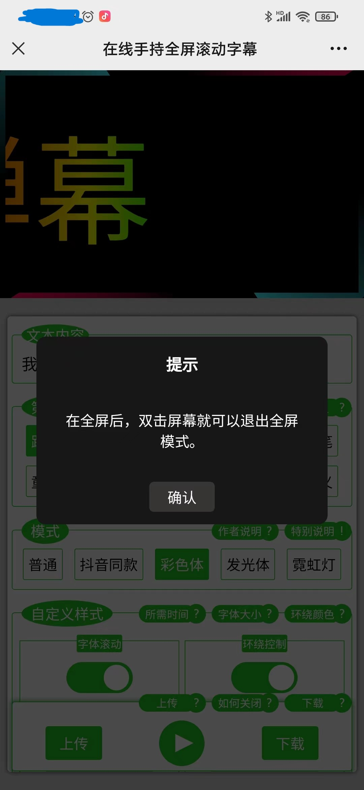

# 在线手持全屏滚动字幕

#### 介绍
- 支持全屏、滚动字幕、固定字幕，含有各种特效绚丽的样式，可自由搭配样式，让你成为全场最靓的仔。
- 适用于搭讪、机场接机、接人、演唱会、寻人、赛场助威、地铁搭讪等等

#### 功能
- 1.实现多方面的自由搭配，可以根据自己的审美搭配出好看的样式。
- 2.附带下载和上传功能，这样搭配好后，就可以下载下来，等下一次把文件再上传上去，就不需要再重复设置了。

#### 使用要求
- 1.页面样式主要趋向于手机端，电脑端也是可以用的。
- 2.里面有些样式可能会很耗性能，需要保证你的设备性能不是那么糟糕。
- 3.需要较新的浏览器，老的浏览器可能会没有动画的执行

#### 问题说明
- 对于下载功能，微信处于安全考虑，可能是不支持下载的，如果你想要使用下载功能可能需要在浏览器打开。
- 

#### 功能截图（自认为好看的部分）
- 1.开始页面
- 
- 

- 2.可以调节字体和样式
- 

- 3.可以控制环绕效果
- 
- 

- 4.全屏滚顶的情况，彩色+环绕+滚动+全屏
- 
- 

- 5.全屏不滚动居中，霓虹灯+环绕+全屏+居中
- 
- 

- 6.退出全屏方法
- 

#### 演示网站
> [https://xiaomaomi-xj.github.io/scrolling-subtitles](https://xiaomaomi-xj.github.io/scrolling-subtitles)